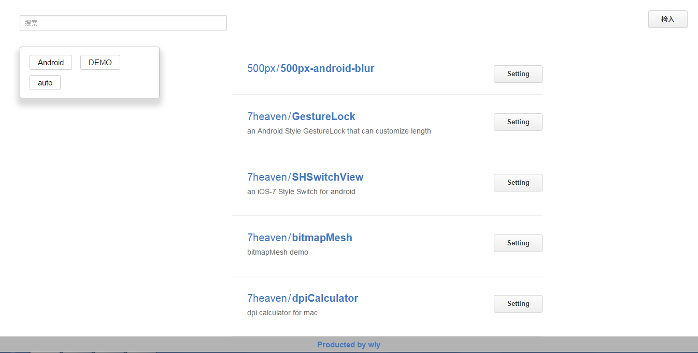
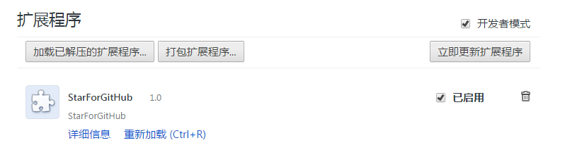
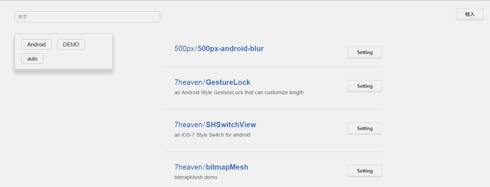

# StarForGitHub
github star标签式管理Chrome插件

### 更新
火狐版扩展，准备中。。。

### 关于
本软件是管理github已star库的chrome拓展，主要的功能是支持标签式管理，通过标签分类管理star。目前最新版本是1.0。

### 安装(未发布)
1. 下载后，单独提取出`src`中的`StarForGitHub`,然后以“加载已解压的扩展程序”安装。
2. 下载后，单独提取出`dist`中的`crx`文件，拖拽进Chrome即可安装。

### 如何使用

1. ##### 导入已有的stars
	在自己的账号已登录的情况下，点击“import”，StarForGitHub将会自动导入自己账号已star的库。`不要重复点击“import”`，否则会造成数据重复，今后会修复。

2. ##### 新star的repository
	当你进入github页面并点击star时，StarForGitHub将会弹窗提醒你添加相应的tag标签。
	同一repository可以拥有多个标签，并且支持中文。如果一次输入多个tag，请`以空格区分多个不同的标签`。如果点击“取消”，StarForGithub将会为你自动添加“auto”标签。

3. ##### 标签查询
	在左上角的搜索框中输入想要查找的标签名，回车即可得到相应的repository。
	搜索框的下方显示自己所有的标签，点击即可查询标签所对应的相应的repository。

4. ##### 添加标签与删除标签
	点击每个repository右上角的`setting`，即进入设置页面。你可以通过点击标签的删除按钮，对该repository的各个标签执行删除操作。在文本框中输入新增的标签（多个标签的规则同上），点击`OK`，即可添加。

## 注意
因为并没有Google的Chrome扩展发布的账号，所以没有在应用市场上发布。在使用的时候需要注意：`无法自动升级，如果删除该扩展，相应的indexDB数据库可能会被删除，`自己设置的tag也就没有了。得失还请大家考量。

## License
Created by and copyright wly. Released under the MIT license.
